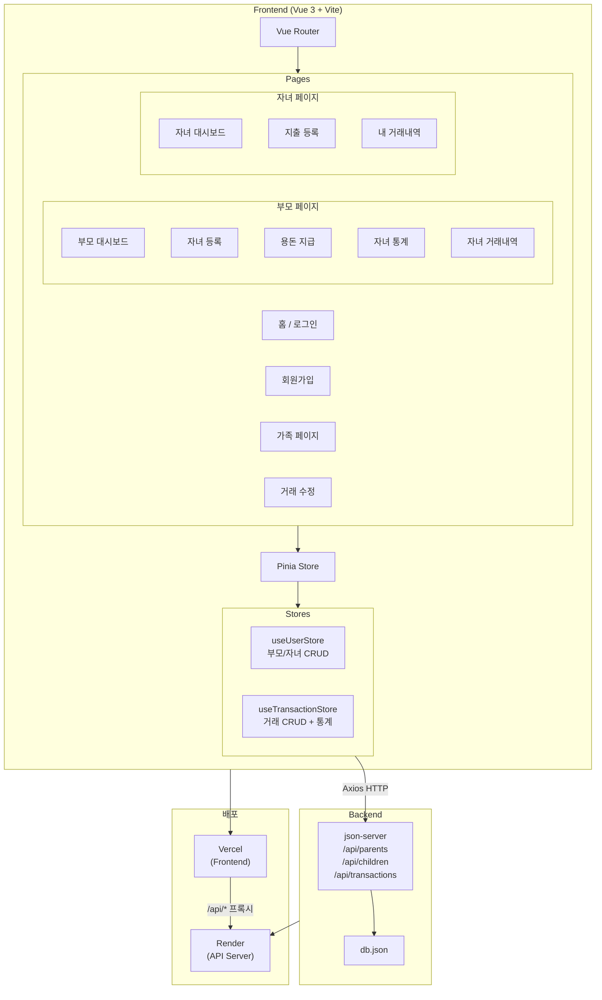
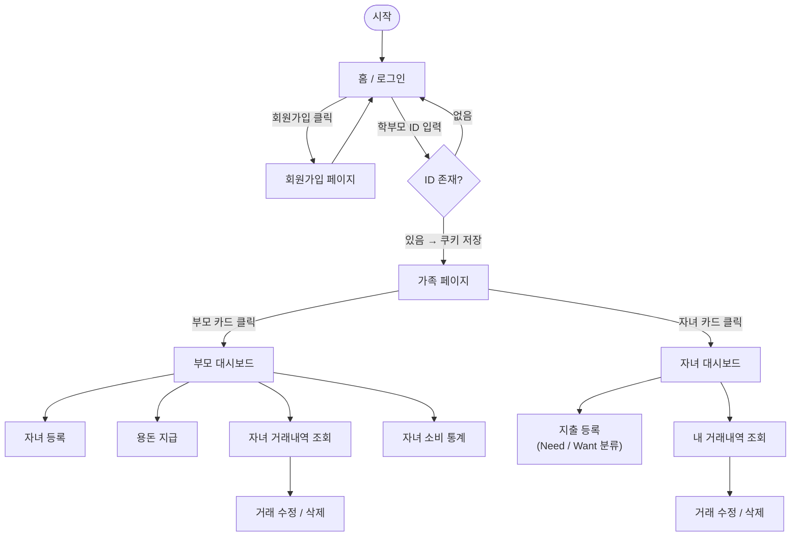

# 티끌저금통 (Dustbank)

> 우리 아이의 첫 번째 경제 습관을 함께 만들어가는 가족 용돈 관리 서비스

---

## 목차

- [프로젝트 소개](#프로젝트-소개)
- [주요 기능](#주요-기능)
- [기술 스택](#기술-스택)
- [프로젝트 구조](#프로젝트-구조)
- [서비스 구조도](#서비스-구조도)
- [화면 흐름](#화면-흐름)
- [데이터 모델](#데이터-모델)
- [설치 및 실행](#설치-및-실행)
- [배포](#배포)

---

## 프로젝트 소개

**티끌저금통**은 부모와 자녀가 함께 사용하는 용돈 관리 웹 애플리케이션입니다.  
부모는 자녀에게 용돈을 지급하고 소비 패턴을 모니터링하며, 자녀는 직접 지출을 기록하고 Need / Want 분류를 통해 올바른 경제 습관을 형성합니다.

---

## 주요 기능

### 부모 (Parent)
- 회원가입 및 로그인 (ID + 아바타 선택)
- 자녀 등록 / 삭제
- 자녀에게 용돈(수입) 지급 — 정기용돈 · 보너스 · 기타
- 자녀별 거래 내역 조회 · 수정 · 삭제
- 자녀별 주간 소비 통계 차트 확인

### 자녀 (Child)
- 부모가 지급한 용돈 잔액 확인
- 지출 직접 등록 — Need(필요) / Want(욕구) 분류 + 카테고리 선택
- 본인 거래 내역 조회 · 수정 · 삭제
- 주간 소비 통계 (수입 · 지출 합계, Need/Want 비율, 카테고리별 금액)

---

## 기술 스택

| 구분 | 기술 |
|------|------|
| Frontend | Vue 3 (Composition API), Vite 8 |
| 상태 관리 | Pinia |
| 라우팅 | Vue Router 5 |
| HTTP 통신 | Axios |
| UI | Bootstrap 5 |
| 차트 | Chart.js, vue-chartjs, chartjs-plugin-datalabels |
| Backend (Mock) | json-server |
| 배포 | Vercel (Frontend), Render (API) |

---

## 프로젝트 구조

```
Dustbank/
├── public/
│   └── logo.svg                      # 서비스 로고 (돼지 저금통)
├── src/
│   ├── assets/
│   │   ├── icons/                    # 아바타 아이콘 (icon1~8.png)
│   │   ├── images/                   # 기타 이미지 리소스
│   │   └── main.css                  # 전역 스타일
│   ├── components/
│   │   ├── common/                   # 공통 레이아웃 컴포넌트
│   │   │   ├── Header.vue
│   │   │   ├── Footer.vue
│   │   │   ├── ChildNav.vue          # 자녀 전용 네비게이션
│   │   │   ├── ParentNav.vue         # 부모 전용 네비게이션
│   │   │   └── FamilyNav.vue         # 가족 페이지 네비게이션
│   │   ├── transactions/             # 거래 관련 컴포넌트
│   │   │   ├── TransactionList.vue
│   │   │   ├── TransactionItem.vue
│   │   │   ├── Stats.vue             # 주간 통계 차트
│   │   │   ├── Category.vue          # 카테고리별 차트
│   │   │   └── NeedWant.vue          # Need/Want 비율 차트
│   │   └── user/                     # 사용자 관련 컴포넌트
│   │       ├── UserList.vue
│   │       ├── UserParentItem.vue
│   │       ├── UserChildItem.vue
│   │       ├── ChildList.vue
│   │       └── ChildItem.vue
│   ├── composables/
│   │   └── useParentCookie.js        # 부모 ID 쿠키 관리
│   ├── pages/
│   │   ├── Home.vue                  # 로그인 페이지
│   │   ├── Register.vue              # 회원가입 페이지
│   │   ├── Family.vue                # 가족 구성원 페이지
│   │   ├── EditTransaction.vue       # 거래 수정 페이지
│   │   ├── child/
│   │   │   ├── ChildDashboard.vue    # 자녀 대시보드 (소비 통계)
│   │   │   ├── ChildTransactions.vue # 자녀 거래 내역
│   │   │   └── AddExpenditure.vue    # 지출 등록
│   │   └── parent/
│   │       ├── ParentDashboard.vue   # 부모 대시보드
│   │       ├── AddChild.vue          # 자녀 등록
│   │       ├── AddIncome.vue         # 용돈 지급
│   │       ├── MyChildTransactions.vue # 자녀 거래 내역 (부모 뷰)
│   │       └── MyChildStats.vue      # 자녀 소비 통계 (부모 뷰)
│   ├── router/
│   │   └── index.js                  # 라우터 설정 및 인증 가드
│   ├── stores/
│   │   ├── user.js                   # 사용자(부모/자녀) 상태 관리
│   │   └── transaction.js            # 거래 상태 관리 및 통계 계산
│   ├── App.vue
│   └── main.js
├── db.json                           # json-server 데이터 파일
├── server.js                         # json-server 실행 스크립트
├── vite.config.js
├── vercel.json                       # Vercel 배포 설정
└── package.json
```

---

## 서비스 구조도



---

## 화면 흐름



---

## 데이터 모델

### parents

| 필드 | 타입 | 설명 |
|------|------|------|
| id | string | 부모 고유 ID (로그인 키) |
| nickname | string | 닉네임 |
| iconId | number | 아바타 아이콘 번호 (5~8) |

### children

| 필드 | 타입 | 설명 |
|------|------|------|
| id | string | 자녀 고유 ID |
| parentId | string | 부모 ID (외래 키) |
| nickname | string | 닉네임 |
| iconId | number | 아바타 아이콘 번호 (1~4) |
| balance | number | 현재 잔액 (원) |

### transactions

| 필드 | 타입 | 설명 |
|------|------|------|
| id | string | 거래 고유 ID |
| childId | string | 자녀 ID |
| parentId | string | 부모 ID |
| type | `"I"` \| `"E"` | 수입(Income) / 지출(Expenditure) |
| category1 | `"N"` \| `"W"` \| null | Need / Want (지출만 해당) |
| category2 | string \| null | 세부 카테고리 (식사·간식·장난감·취미·준비물·기타) |
| category3 | string \| null | 수입 유형 (정기용돈·보너스·기타) |
| amount | number | 금액 (원) |
| date | ISO 8601 | 거래 일시 |
| createdAt | ISO 8601 | 생성 일시 |
| memo | string | 메모 |

---

## 설치 및 실행

### 환경 요구사항

- Node.js `^20.19.0` 또는 `>=22.12.0`

### 설치

```sh
npm install
```

### 개발 서버 실행

프론트엔드와 백엔드를 각각 터미널에서 실행합니다.

```sh
# 백엔드 (json-server, 기본 포트 3000)
npm start

# 프론트엔드 (Vite 개발 서버)
npm run dev
```

### 프로덕션 빌드

```sh
npm run build
```

---

## 배포
링크 : https://dustbank-orpin.vercel.app/

| 구분 | 서비스 | 역할 |
|------|--------|------|
| Frontend | [Vercel](https://vercel.com) | 정적 파일 호스팅 |
| Backend API | [Render](https://render.com) | json-server REST API |

`vercel.json`에서 `/api/*` 경로 요청을 Render 서버로 프록시하여 CORS 문제 없이 연동합니다.

```json
{
  "rewrites": [
    { "source": "/api/:path*", "destination": "https://dustbank.onrender.com/api/:path*" },
    { "source": "/(.*)",       "destination": "/index.html" }
  ]
}
```
